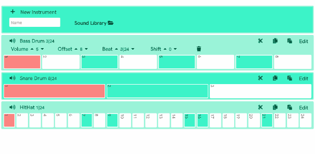

# NuDrum

**[Let's Play NuDrum](https://nudrum.web.app/)**

The project aims to create a polirhythmic and polymetric drum machine, through a responsive web interface. These features are limiting to all the instruments available on a drum machine (physical or digital). NuDrum unlike the previous ones, makes every single instrument polyrhythm and polymetric, in order to improve the visual learning of the various rhythmic patterns created by the users using the platform. In addition, it will be available through Google's Firebase services, to upload your own samples to the platform and share rhythmic patterns with the audience.

### What is rhythm?
The sense of rhythm was developed in the early stages of hominid evolution by the
forces of natural selection to induce battle trance, promote the development of a defense system of early hominids. In Sub-Saharan Africa it evolved in complex forms such as multi-layered polyrhythm and simultaneous rhythms in more than one time signature. 

### What is polyrhythm?
A polyrhythm is the simultaneous use of two or
more conflicting rhythms, that are not readily
perceived as deriving from one another, or as
simple manifestations of the same meter
- Polyrhythms can be distinguished from irrational
rhythms (tuplets), which can occur within the context
of a single part
- Polyrhythms require at least two rhythms to be played
concurrently, one of which is typically an irrational
rhythm

Click on the link to watch a [simple polyrhythm pattern](https://nudrum.web.app/?p=N5sj6) on NuDrum

### What is polymeter?
Rhythm in music is characterized by a repeating sequence of stressed and unstressed beats (strong vs. weak; upbeat vs. downbeat) and divided into bars organized by time signature and tempo indications. In music, time signature always occurs at start of a paper sheet, it represents the rhythm of the piece.

---
*Modern drum machine can be set on a single time signature forcing performer to play all the rhythm in a strict way.*

---

## How to make music

With NuDrum we can set different time signature (even or odd) and find new amazing patterns.

 

On the left of every instrument we can:
 1. **Mute** the track

 On the right:

 2. **Clean** row
 3. **Copy** pattern
 4. **Paste** pattern
 5. Open **Edit Menu**

The **Edit Menu** will slide from the left to the right, standing on the left margin of the screen. Here, we can choose from different options. 
In the first row (from the left to the right) we can:

 

1. **Volume** - Change the volume
2. **Offset** - Change the offset
3. **Beat** - Change the notes duration

In the second row:
1. **Shift** - Shift right (up arrow) or shift left (down arrow) the pattern.
2. **Delete** - Delete the track

## How does beat work

Beat goes from: **1** to **8**. The beat represents notes duration based on the rhythmical context [**1**] = 1/64 , [**2**] = 1/32 and so on. Default time signature is **4/4** but changing the beat it possible to turn the time and create a cross-rhythm. 

Examples:  
[Cross-Rhythm 7:4 | Signature 7/8](https://nudrum.web.app/?p=X5q29) (Sound of Muzak)

If we set the Kick to **7** and Ride to **4** we have obtained a 7/8 time signature and a 7:4 Cross-Rhythm.  

[Cross-Rhythm 7:2 | Signature 7/8](https://nudrum.web.app/?p=S8c0l) (Porcupine Tree - Dark Matter)

If we set the Kick to **7** and Ride to **2** we have obtained a 7/8 time signature and a 7:2 Cross-Rhythm

---
*Minimum offset is 3*

---

## How to create patterns
Standing on the right margin of the screen we can found the pattern menu. Here we can **Save** our own pattern, setting a proper name or **Load** a previous one knowing its unique code. Unique code is recognizable in the brackets **[ ]**, it's followed by the timestamp and the title. 

Every pattern can be easily reached typing NuDrum url, followed by **?p=OurCodeHere**  
Example - https://nudrum.web.app/?p=X5q29

**Please**... **Please**... **Please**... Use the right name for your patterns to help everyone to understand and learn from your rhythmic structures. Keep in mind that NuDrum is an educational tool for everyone

 

## How to upload
The first row is dedicated to create new instruments. We must choose a name for the instrument, then the sound from the **Sound Library**. Once finished, click on the plus button and try our new sample.

 

We can choose from many sounds or upload ours. Clicking on **Sound Library** will be popup the upload menu. On the left, we can choose the  category, then select the sample by clicking on or we can also upload a new one selecting our file and clicking on the icon.

 

## Storage's rules

All file are downloaded and uploaded on Firebase Storage. Any operation must be follow some rules to read and write; in particular files are allow to be written into the following paths:

    /Clap , /Crash , /HitHat , /Kick , /Ride , /Rim , /Snare , /Tom, /Loop

Every file is subject to the following constraints:
    
    1. File is less than 5MB
    2. Content type is an audio
    3. Uploaded content type matches audio/.* content type
    4. File name is less than 32 characters
    
## Standalone application
You can build your own standalone floating app thanks to [Electron](https://electronjs.org/) 
    
    git clone https://github.com/toboko/nudrum-drum-machine
    cd nudrum-drum-machine/electron
    yarn install
    npm start

    // or if you already installed all the dependecies, from root folder..
    npm run play

## Thanks to
[AngularJS](https://github.com/angular/angular.js) - AngularJS is a JavaScript-based open-source front-end web application framework  
[Pizzicato.js](https://github.com/alemangui/pizzicato) - Library to simplify the way you create and manipulate sounds with the Web Audio API  
[Math.js](https://github.com/josdejong/mathjs) - Math.js is an extensive math library for JavaScript  
[Toastr](https://github.com/CodeSeven/toastr) - Simple javascript toast notification  
[Electron](https://github.com/jlongster/electron-with-server-example) - Client/Server implementation  
[jQuery](https://github.com/jquery/jquery) - jQuery JavaScript library 

## Copyright
NuDrum is hosted on [Google Firebase](https://firebase.google.com/) services

Copyright © 2018-2019 All the rights reserved to Nicola Bombaci

## Licence

NuDrum is under Academic Free License 3.0
[(AFL3)](https://tldrlegal.com/license/academic-free-license-3.0-(afl))

