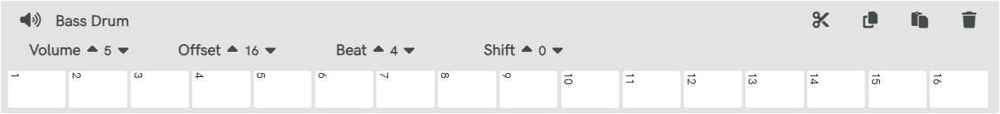

# NuDrum - Polyrhythmic Drum Machine


**[Try NuDrum Now](https://nudrum.web.app/)**

## Table of Contents

- [Overview](#overview)
- [Musical Concepts](#musical-concepts)
  - [Rhythm](#what-is-rhythm)
  - [Polyrhythm](#what-is-polyrhythm)
  - [Polymeter](#what-is-polymeter)
- [Getting Started](#getting-started)
  - [Web Application](#web-application)
  - [Standalone Application](#standalone-application)
- [User Guide](#user-guide)
  - [Instrument Controls](#instrument-controls)
  - [Edit Controls](#edit-controls)
  - [Beat Controls](#beat-controls)
  - [Main Controls](#main-controls)
  - [Creating New Instruments](#creating-new-instruments)
  - [Sharing Patterns](#sharing-patterns)
- [Technical Information](#technical-information)
  - [Storage Rules](#storage-rules)
  - [Development Setup](#development-setup)
  - [Available Scripts](#available-scripts)
- [Project Deployment Guide](#project-deployment-guide)
  - [Prerequisites](#prerequisites)
  - [Environment Setup](#environment-setup)
  - [Configuration Generation](#configuration-generation)
  - [Firebase Deployment](#firebase-deployment)
  - [Netlify Deployment](#netlify-deployment)
  - [Environment Variables in Netlify](#environment-variables-in-netlify)
  - [Project Structure](#project-structure)
  - [Notes](#notes)
- [Troubleshooting](#troubleshooting)
  - [Known Issues](#known-issues)
  - [Common Solutions](#common-solutions)
- [Credits](#credits)
- [License](#license)

## Overview

NuDrum is a polyrhythmic and polymetric drum machine with a responsive web interface. Unlike traditional drum machines that limit all instruments to a single time signature, NuDrum allows each instrument to have its own rhythm and meter. This design improves the visual learning of various rhythmic patterns and makes complex rhythmic structures more accessible.

The platform is built on Google's Firebase services, allowing users to upload custom samples and share rhythmic patterns with others.

## Musical Concepts

### What is Rhythm?

The sense of rhythm was developed in the early stages of hominid evolution by the forces of natural selection. In Sub-Saharan Africa, it evolved into complex forms such as multi-layered polyrhythm and simultaneous rhythms in more than one time signature.

### What is Polyrhythm?

A polyrhythm is the simultaneous use of two or more conflicting rhythms that are not readily perceived as deriving from one another or as simple manifestations of the same meter.

- Polyrhythms can be distinguished from irrational rhythms (tuplets), which can occur within the context of a single part
- Polyrhythms require at least two rhythms to be played concurrently, one of which is typically an irrational rhythm

Example: [7:4 Cross-Rhythm](https://nudrum.web.app/?p=X5q29)

### What is Polymeter?

Rhythm in music is characterized by a repeating sequence of stressed and unstressed beats organized by time signature and tempo indications. Traditional drum machines restrict all instruments to a single time signature, but NuDrum allows different time signatures for each instrument.

## Getting Started

### Web Application

1. Visit [https://nudrum.web.app/](https://nudrum.web.app/)
2. Press the spacebar or click the play button to start/stop the loop
3. Experiment with different beats and patterns

### Standalone Application

You can build your own standalone desktop application using Electron:

```shell
# Clone the repository
git clone https://github.com/toboko/nudrum-drum-machine

# Navigate to the electron directory
cd nudrum-drum-machine/electron

# Install dependencies
npm install

# Start the application
npm start
```

Or if you've already installed all dependencies, from the root folder:

```shell
npm run play
```

## User Guide

### Instrument Controls

Each instrument track has the following controls:



On the left:
1. **Mute** - Toggle instrument sound on/off

On the right:

2. **Cut** - Clear the pattern
3. **Copy** - Copy the pattern
4. **Paste** - Paste a copied pattern
5. **Delete** - Remove the instrument

### Edit Controls

The edit menu above each track provides these options:


1. **Volume** - Adjust instrument volume (0-10)
2. **Offset** - Change the visible steps (minimum 3)
3. **Beat** - Change note duration (1-8)
4. **Shift** - Shift pattern left or right

### Beat Controls

The beat value (1-8) represents note duration:
- **Beat 1** = 1/64
- **Beat 2** = 1/32
- And so on...

The default time signature is 4/4, but you can create cross-rhythms by changing beats:

Examples:
- [Cross-Rhythm 7:4 | Signature 7/8](https://nudrum.web.app/?p=X5q29) (Sound of Muzak)
- [Cross-Rhythm 7:2 | Signature 7/8](https://nudrum.web.app/?p=S8c0l) (Porcupine Tree - Dark Matter)

### Main Controls

The control area at the bottom provides these functions:


1. **Play** - Start/Stop the loop (also works with spacebar)
2. **Minus** - Decrease tempo by 1 BPM
3. **BPM** - Current tempo in beats per minute
4. **Plus** - Increase tempo by 1 BPM
5. **Tap** - Tap to set tempo
6. **Share** - Share your pattern

### Creating New Instruments

To add a new instrument:

1. Enter a name in the "New Instrument" field
2. Click "Sound Library" to browse or upload samples
3. Select a sample from the library
4. Click the plus button to add the instrument


### Sharing Patterns

To share your pattern:

1. Click the Share button in the control area
2. Copy the generated link or use the social sharing buttons
3. Anyone with the link can access your pattern

Pattern links follow this format: `https://nudrum.web.app/?p=<PatternCode>`

Example: https://nudrum.web.app/?p=X5q29

## Technical Information

### Storage Rules

Files are stored on Firebase Storage with these rules:

- Files can be written to these paths: `/Clap`, `/Crash`, `/HitHat`, `/Kick`, `/Ride`, `/Rim`, `/Snare`, `/Tom`, `/Loop`
- File constraints:
  1. Maximum size: 5MB
  2. Content type must be audio
  3. Content type must match audio/.* format
  4. Filename must be less than 32 characters

### Development Setup

1. Clone the repository:
```shell
git clone https://github.com/toboko/nudrum-drum-machine cd nudrum-drum-machine
```

2. Install dependencies:
```shell
npm install
```


3. Start the development server:
```shell
npm start
```


### Available Scripts

- `npm run play` - Run the Electron app
- `npm run lite` - Start lite-server on port 10001
- `npm start` - Alias for npm run lite
- `npm run generate-config` - Generate configuration files
- `npm run deploy` - Deploy to Firebase

## Project Deployment Guide

This document provides instructions for deploying this project to both Firebase and Netlify.

### Prerequisites

- Firebase CLI and/or Netlify CLI (for command-line deployments)
- A Firebase project and/or Netlify account

### Environment Setup

Create a `.env` file in the root directory with the following variables:

```
API_KEY=your_api_key
AUTH_DOMAIN=your_auth_domain
DATABASE_URL=your_database_url
PROJECT_ID=your_project_id
STORAGE_BUCKET=your_storage_bucket
MESSAGING_SENDER_ID=your_messaging_sender_id
```

### Configuration Generation

Before deploying, you need to generate the `config.js` file from your environment variables:

```bash
node build/generate-config.js
```

This script reads from `js/config.js.template` and replaces placeholders with your environment variables.

### Firebase Deployment

#### Setup

1. Install Firebase CLI:
   ```bash
   npm install -g firebase-tools
   ```

2. Login to Firebase:
   ```bash
   firebase login
   ```

3. Initialize Firebase (if not already done):
   ```bash
   firebase init
   ```

#### Deploy

1. Generate the config file:
   ```bash
   npm run build
   ```

2. Deploy to Firebase:
   ```bash
   npm run deploy-firebase
   ```

For deploying specific targets:
```bash
firebase deploy --only hosting:default
firebase deploy --only hosting:redirect
```

### Netlify Deployment

#### Setup

1. Create a `netlify.toml` file:
   ```toml
   [build]
     publish = "."
     command = "npm run build"

   [[redirects]]
     from = "/*"
     to = "/index.html"
     status = 200

   [[headers]]
     for = "**/*.js"
     [headers.values]
       Cache-Control = "max-age=3600"

   [[headers]]
     for = "**/*.html"
     [headers.values]
       Cache-Control = "max-age=3600"

   [[headers]]
     for = "**/*.css"
     [headers.values]
       Cache-Control = "max-age=3600"

   [[headers]]
     for = "/js/config.js"
     [headers.values]
       Cache-Control = "no-cache, no-store, must-revalidate"
   ```

#### Deploy via Netlify UI

1. Go to [app.netlify.com](https://app.netlify.com/)
2. Click "New site from Git"
3. Connect to your Git provider
4. Select your repository
5. Configure build settings:
- Build command: `npm run build`
- Publish directory: `.`
6. Click "Deploy site"

#### Deploy via Netlify CLI

1. Install Netlify CLI:
   ```bash
   npm install -g netlify-cli
   ```

2. Login to Netlify:
   ```bash
   netlify login
   ```

3. Initialize your site:
   ```bash
   netlify init
   ```

4. Deploy your site:
   ```bash
   netlify deploy --prod
   ```

### Environment Variables in Netlify

1. Go to your Netlify dashboard
2. Navigate to your site
3. Go to Site settings > Build & deploy > Environment
4. Add each environment variable:
- API_KEY
- AUTH_DOMAIN
- DATABASE_URL
- PROJECT_ID
- STORAGE_BUCKET
- MESSAGING_SENDER_ID

### Project Structure

- `js/config.js.template`: Template for Firebase configuration
- `build/generate-config.js`: Script to generate config from environment variables
- `firebase.json`: Firebase configuration
- `netlify.toml`: Netlify configuration

### Notes

- The `config.js` file is generated during the build process and should not be committed to version control
- Both Firebase and Netlify deployments use the same config generation process
- The `.env` file should not be committed to version control

## Troubleshooting

### Known Issues

- Attack doesn't work after the first playback of a sound in Chrome
- This is a known issue with the Pizzicato library: [Issue #80](https://github.com/alemangui/pizzicato/issues/80)
- Audio timing issues in background tabs
- The app implements periodic resyncing to maintain timing accuracy

### Common Solutions

- If audio is not playing, check if your browser has allowed audio permissions
- If timing seems off, try clicking the play button to stop and restart the loop
- For performance issues, try reducing the number of instruments or complexity of patterns

## Credits

NuDrum uses these open-source libraries:

- [AngularJS](https://github.com/angular/angular.js) - JavaScript-based front-end web application framework
- [Pizzicato.js](https://github.com/alemangui/pizzicato) - Library for Web Audio API
- [Math.js](https://github.com/josdejong/mathjs) - Math library for JavaScript
- [Toastr](https://github.com/CodeSeven/toastr) - JavaScript toast notifications
- [Electron](https://github.com/jlongster/electron-with-server-example) - Client/Server implementation
- [jQuery](https://github.com/jquery/jquery) - JavaScript library

## License

NuDrum is hosted on [Google Firebase](https://firebase.google.com/) services.

Copyright © 2018-2025 All rights reserved by Nicola Bombaci

NuDrum is under Academic Free License 3.0 [(AFL3)](https://tldrlegal.com/license/academic-free-license-3.0-(afl))